# Lab 3 — Splunk SIEM & Log Analysis

**Splunk Enterprise · Azure VMs · VNet Peering · SOC Detection Skills**

| Field | Value |
|---|---|
| Certification alignment | CompTIA Security+ · CySA+ · Splunk Core Certified User |
| Environment | Azure (Ubuntu 22.04 Splunk VM, peered with an existing Windows Server VM) |
| Tools | Splunk Enterprise (free licence), Azure CLI, Linux Mint, VNet Peering |
| Cost | $0 — Splunk Free licence covers everything in this lab |
| Career relevance | SOC Analyst (Tier 1–3) · Security Engineer · Incident Responder |

---

## The Business Problem This Lab Solves

A medium-sized organisation generates millions of log events every day — Windows Event Logs from workstations, authentication logs from Active Directory, firewall logs from network equipment, cloud resource logs. Without a SIEM, those logs sit in separate systems and nobody can search across them, correlate events, or identify patterns that indicate an attack.

The SIEM is the security operations centre's primary tool. When an alert fires, the SOC analyst opens the SIEM and searches the logs to understand what happened, when, from where, and what was affected.

| Role | How this lab applies |
|---|---|
| SOC Analyst Tier 1 | Monitoring dashboards for alerts, searching logs for suspicious activity, escalating findings |
| SOC Analyst Tier 2–3 | Building detection rules, correlating events across data sources, threat hunting |
| Cloud Security Engineer | Microsoft Sentinel and AWS Security Hub use the same SIEM concepts — this lab teaches the mental model |
| Incident Responder | Searching logs during an active incident, building a timeline of events, identifying scope of compromise |

---

## Architecture

This deployment connects **two separately-built Azure VMs** — a Windows Server VM from an earlier lab, and a new Ubuntu VM running Splunk — using **VNet peering**, rather than deploying both fresh in one network. This reflects a realistic scenario: in a real organisation, workloads are rarely built in a single flat network from day one; connecting existing, isolated VNets is a routine networking task.

```
┌─────────────────────────────┐         ┌──────────────────────────────┐
│  vnet-centralindia-1         │         │  vnet-splunk-lab3             │
│  (10.0.0.0/16)                │◄──────►│  (10.1.0.0/16)                │
│                               │ Peered │                                │
│  ┌─────────────────────────┐ │         │  ┌──────────────────────────┐ │
│  │ vm-actived               │ │         │  │ splunk-vm                 │ │
│  │ Windows Server           │ │         │  │ Ubuntu 22.04               │ │
│  │ Universal Forwarder      │─┼─────────┼─►│ Splunk Enterprise 10.4.1   │ │
│  │ generates Security /     │ │ :9997  │  │ receives + indexes logs    │ │
│  │ System / Application logs│ │         │  │ web UI on :8000            │ │
│  └─────────────────────────┘ │         │  └──────────────────────────┘ │
└─────────────────────────────┘         └──────────────────────────────┘
        NSG: RDP (3389)                          NSG: SSH (22), Web UI (8000)
                                                   — locked to admin's IP
                                                  Forwarder (9997) — VNet-only
```

Both VMs' Network Security Groups restrict access by source IP or VNet range — SSH and the Splunk web UI are reachable only from the admin's own IP; the forwarder port (9997) accepts traffic only from the two peered VNet ranges, never the public internet.

---

## Key Concepts

**SIEM (Security Information and Event Management):** a platform that collects log data from across an environment and makes it searchable in one place. Its two core jobs are **correlation** (connecting events across systems to reveal patterns) and **alerting** (notifying analysts automatically when suspicious conditions are met).

**SPL (Splunk Processing Language):** the pipeline-based query language used to search Splunk. Example: `index=windows_logs EventCode=4625 | stats count by Account_Name | sort -count` finds failed logins, counts them by username, sorts highest to lowest.

**VNet Peering:** a private connection between two otherwise-isolated Azure Virtual Networks, letting VMs in each reach the other's private IPs directly without routing through the public internet. Used here to connect the pre-existing Windows Server VM's network to a newly-built Splunk network.

**Windows Event IDs used throughout this lab:**
- **4624** — successful logon
- **4625** — failed logon attempt
- **4740** — account lockout

---

## What I Built

1. Deployed a new Ubuntu VM running Splunk Enterprise in its own Virtual Network
2. Peered that VNet (bidirectionally) with the existing Windows Server VM's VNet from an earlier lab
3. Locked down Network Security Group rules by source IP/VNet range rather than leaving ports open to the internet
4. Installed and configured the Splunk Universal Forwarder on the Windows Server VM to ship Security/System/Application event logs to Splunk over the peered network
5. Built SPL searches covering failed logins, successful logins, account lockouts, top failed usernames, and after-hours login activity
6. Built a 4-panel security dashboard (Windows Security Overview) and a scheduled automated brute-force detection alert

---

## Screenshots

**1. Confirming the existing Windows Server VM (from a prior lab) before connecting to it**
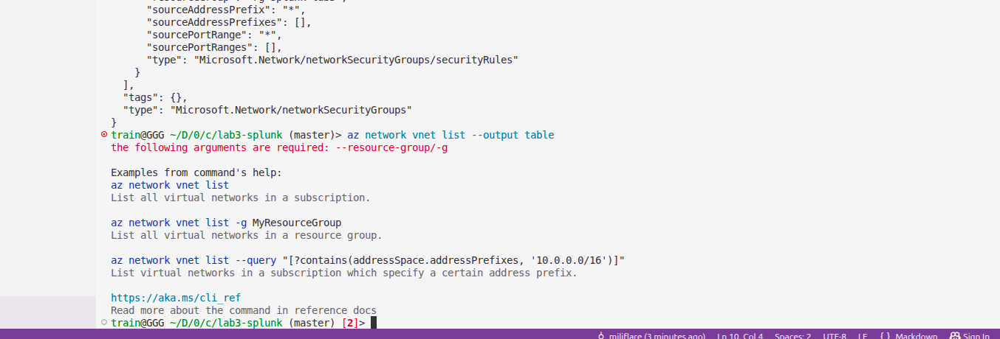

**2. Creating a dedicated VNet for the new Splunk VM**
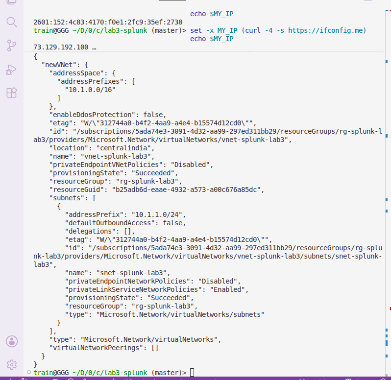

**3. Verifying VNet peering is active in both directions**
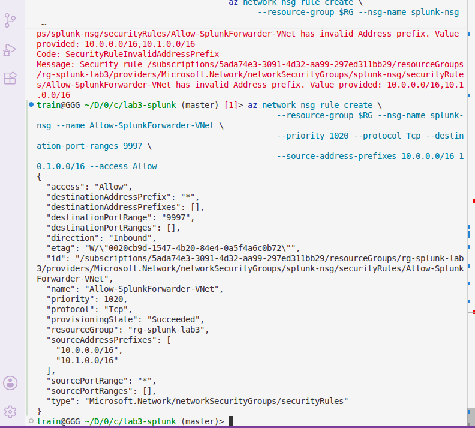

**4. Deploying the Splunk VM into the peered network**
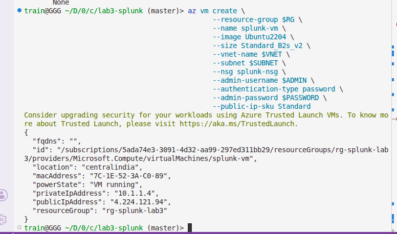

**5. Confirming both VMs running before proceeding**
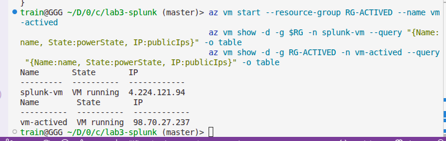

**6. Downloading Splunk Enterprise directly onto the VM via SSH**
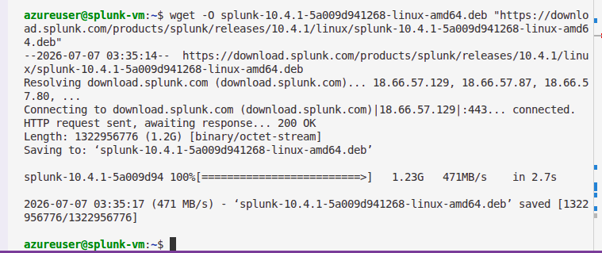

**7. Installing Splunk and setting admin credentials**
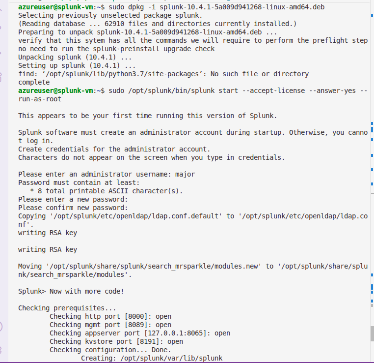

**8. Roadblock — forwarder config still pointed at a previous (deleted) Splunk VM's IP**
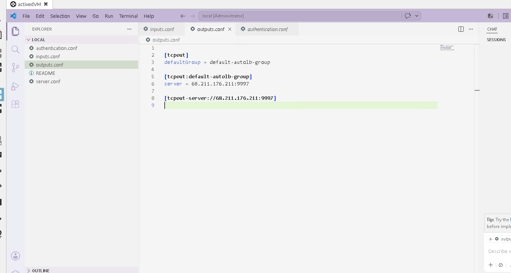

**9. Fix — updated forwarder config to the current Splunk VM's private IP**
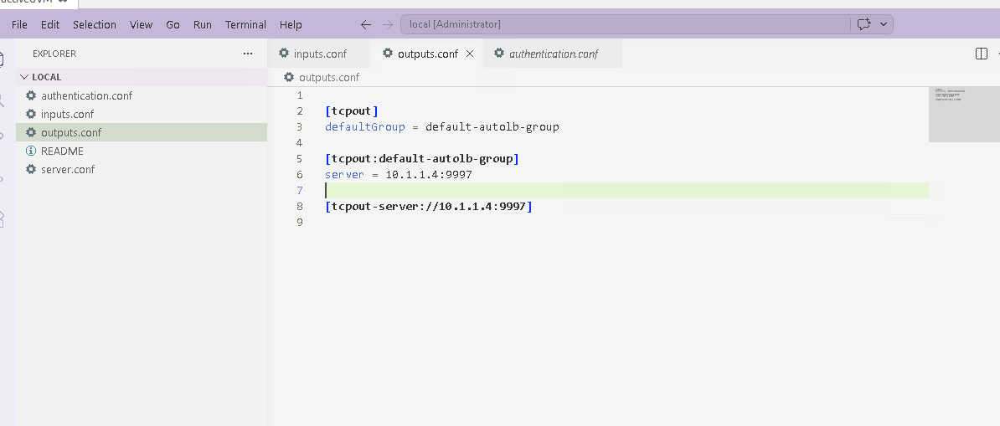

**10. Universal Forwarder service running after the fix**
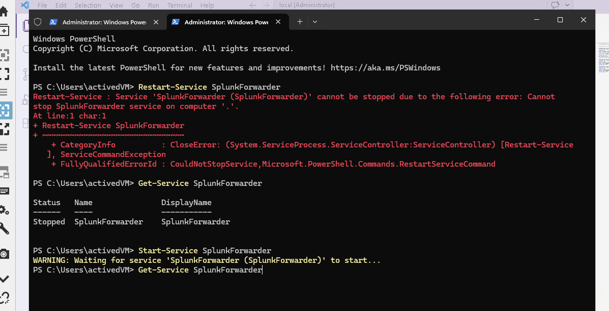

**11. Verification — logs flowing into Splunk end-to-end (peering → forwarder → indexing)**
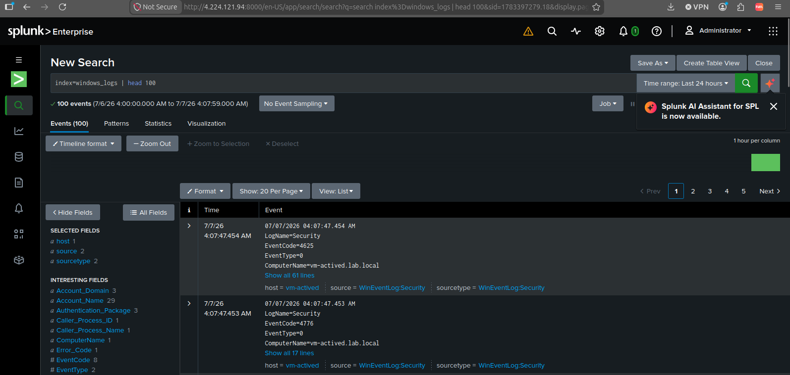

**12. Real-world finding — Splunk detecting live internet brute-force traffic**
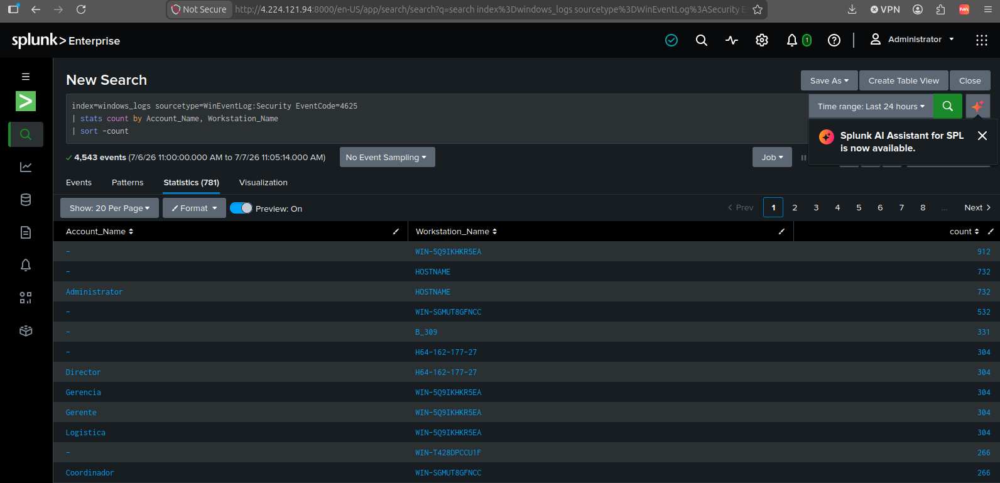

**13. Windows Security Overview dashboard — Failed Logins & Account Lockouts panels**
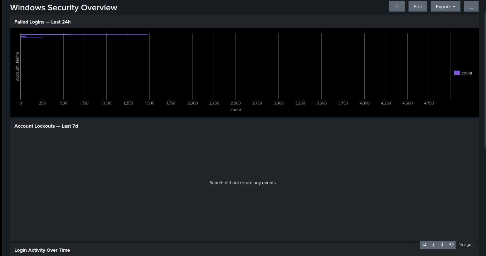

**14. Windows Security Overview dashboard — Login Activity Over Time & Top Source IPs panels**
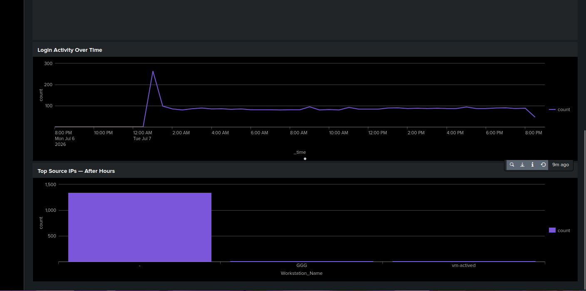

**15. Automated brute-force alert — configured and saved**
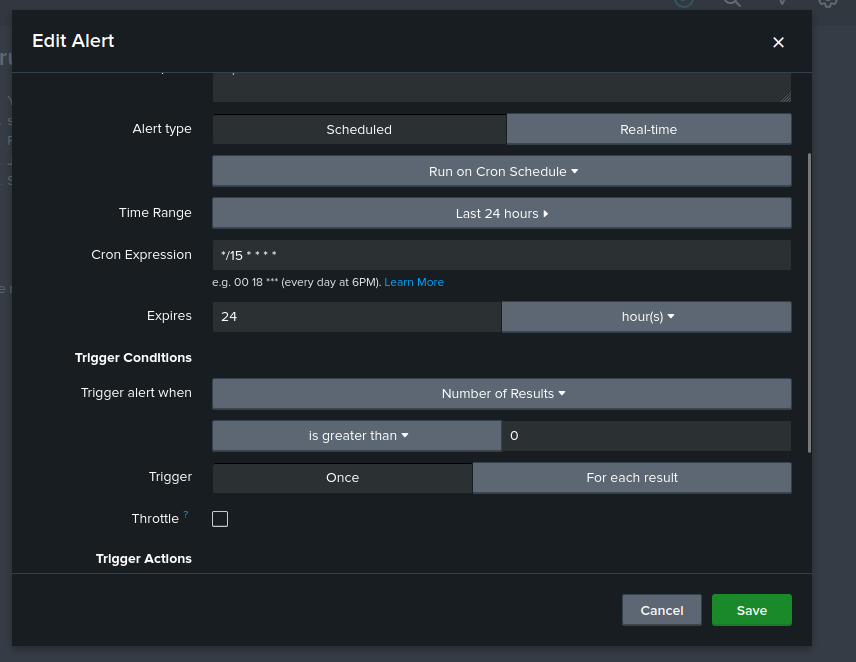

---

## A Real Finding, Not a Simulated One

While running the failed-login search (`EventCode=4625 | stats count by Account_Name, Workstation_Name`), the results showed **4,500+ failed login events in 24 hours** — far beyond anything generated for testing. The account names were Spanish-language generic terms (Director, Gerencia, Gerente, Logistica, Coordinador) and the workstation names were randomly-generated strings (`WIN-5Q9IKHKR5EA`, `B_309`, `H64-162-177-27`) — classic signatures of automated internet bot scanning, not lab test data.

**Root cause:** the Windows Server VM's RDP port (3389) was open to any source IP (`*`), left over from an earlier setup step. The moment that port was reachable from the internet, automated scanners found it and began attempting logins — exactly the kind of activity a SIEM exists to catch.

**Verification:** cross-referencing successful logon events (`EventCode=4624`, `Logon_Type=10`) confirmed only 2 legitimate RDP sessions — no unauthorized access occurred. Account lockout events (`EventCode=4740`) came back at zero, indicating the attack was broad and shallow (many different usernames tried a few times each) rather than a focused attempt against one real account.

**Remediation:** the NSG rule was updated to restrict RDP access to a single trusted IP address, closing the exposure.

This turned a routine lab exercise into a live demonstration of the lab's core lesson: **exposed remote-access ports get attacked continuously and immediately**, and log-based detection is how you find out it's happening.

---

## Verification Checklist

| Check | Result |
|---|---|
| VNet peering connected (both directions) | ✅ Confirmed via `az network vnet peering list` |
| Both VMs running | ✅ `splunk-vm` and `vm-actived` both `VM running` |
| Splunk service running | ✅ `splunkd is running` |
| Universal Forwarder running | ✅ `SplunkForwarder` service `Running` |
| Data flowing into Splunk | ✅ 100+ events returned from `windows_logs` index |
| Failed login detection working | ✅ 4,500+ real-world EventCode 4625 events identified |
| No unauthorized access occurred | ✅ Only 2 legitimate EventCode 4624 / Logon_Type=10 sessions found |
| Account lockouts | ✅ Zero — confirms broad/shallow attack pattern, not targeted |
| Security dashboard built | ✅ Windows Security Overview — all 4 panels functioning |
| Automated alert active | ✅ "Potential Brute Force — High Failure Count" — Enabled, runs every 15 min |
| RDP exposure remediated | ✅ NSG rule restricted to single trusted IP |

---

## What I'd Do Differently

- **Plan non-overlapping VNet CIDRs from the start.** An earlier manual attempt at this lab used the same address space (`172.16.0.0/16`) for both VNets in different regions, which blocked peering entirely once both VMs were built. Planning distinct CIDR blocks up front avoids a rebuild later.
- **Review NSG rules immediately after any lab that opens remote access.** The exposed RDP rule that led to the brute-force finding wasn't a fresh mistake — it was an old rule from an earlier session that never got locked back down. A quick NSG audit at the start of each new lab session would have caught this sooner.
